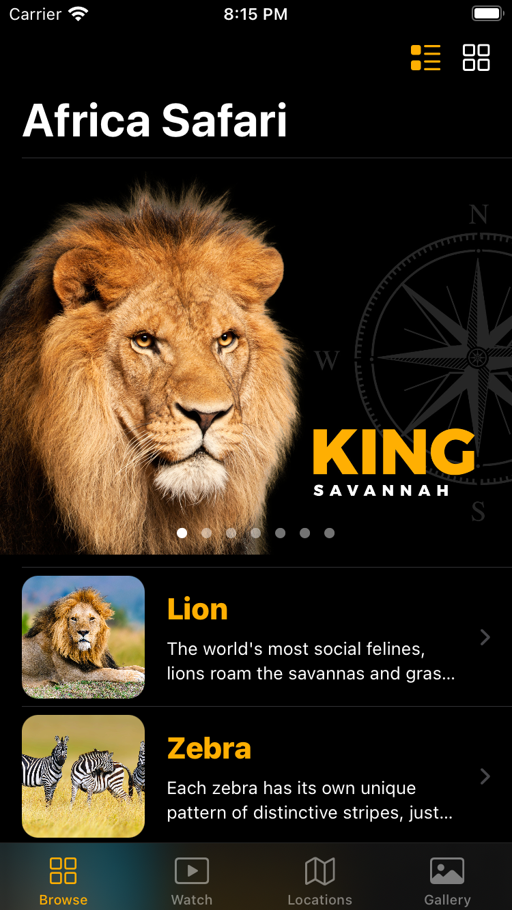
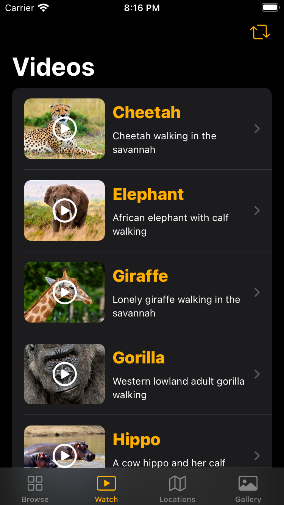
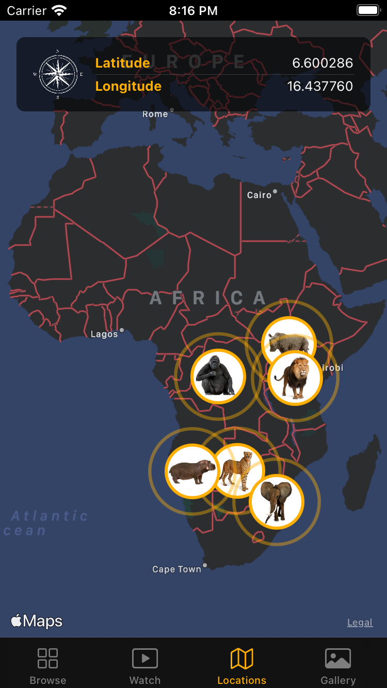
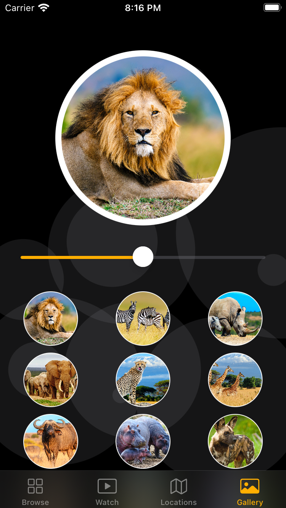
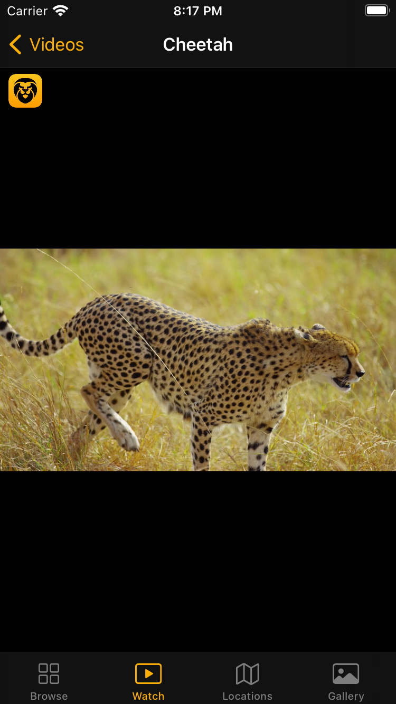
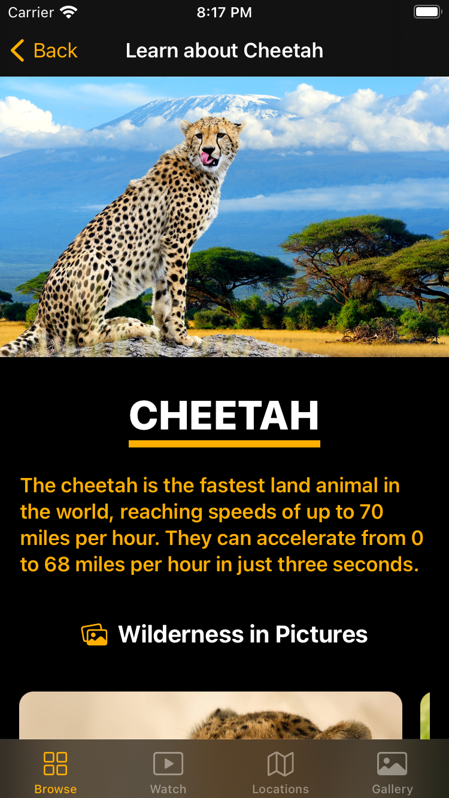
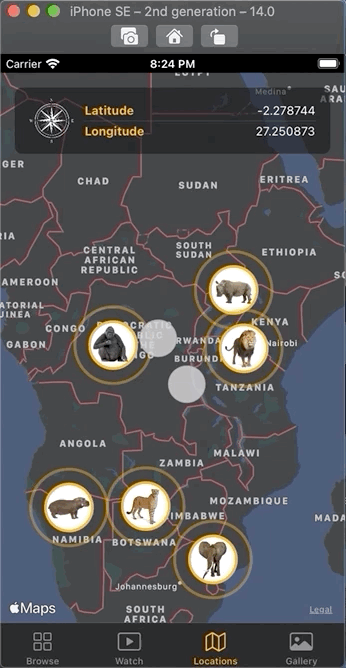

# <u>Africa Safari</u>

An iOS app which helps children to learn about the wildlife found in Africa.
Made with love in SwiftUI 2.0 with Xcode 12.0.1

Children can learn about African Safari by choosing animals from the available list,
can get to know about the facts about animals, get to learn about the places where 
animals can be found by browsing maps, browse pictures in gallery, watch videos of
animals.

## <u>App Screenshots</u>

	
		
	
	
	
	

## <u>App Demo</u>

	
	
	
	

